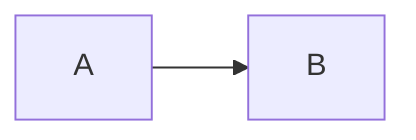

# Sample treatment output (fixture)

## Changeset inventory

| file | domain |
| ---- | ------ |
| a.ts | x |

## Dependency graph

Hard dependency: A -> B

## Risk

PR-1 is HIGH risk. PR-2 is MEDIUM.

## PR boundaries

### PR-1

Files: a.ts

## Merge order / split-to-prs hand-off

Wave 1: PR-1. Base: main.

split-to-prs: branch foo from main.
