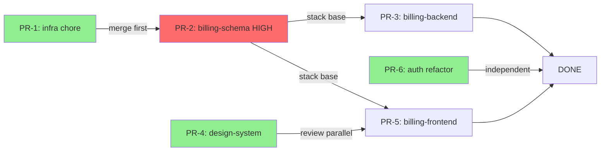

# Pattern 5: Sequencing and Stack Plan

Determine the merge order and identify which PRs can be reviewed in parallel. Produce the final deliverable: a merge sequence, a stacking diagram (when needed), and execution instructions for `split-to-prs`.

## Goal

Given the named PRs from Pattern 4 and their dependency edges from Pattern 2, produce:
1. A **merge sequence** — the order in which PRs must merge to keep main green at every step.
2. A **parallelism map** — which PRs can be opened for review simultaneously (even if they cannot merge simultaneously).
3. A **stacking plan** — for HARD-dependent chains, the base branch each PR should target (main vs a prior PR branch).
4. A **hand-off block** for `split-to-prs` — the exact instructions for executing the split.

## Sequencing rules

**Rule 1: Topological order for HARD dependencies.**
Sort the PR graph topologically. Nodes with no incoming hard-dependency edges can go first. Nodes with incoming edges come after their dependencies.

**Rule 2: Independent PRs can merge in any order but should merge early.**
PRs with no dependencies (no edges in the dependency graph) are quick wins. Schedule them first in the merge sequence — they unblock reviewers and keep the branch list clean.

**Rule 3: Low-risk PRs should open for review immediately.**
Even if a low-risk PR cannot merge before its dependency, open it for review now. Reviewers can approve it while waiting for the dependency to land.

**Rule 4: HIGH-risk PRs should have dedicated review time.**
Do not open a HIGH-risk PR simultaneously with other PRs targeting the same reviewer team if it can be avoided. Give it focused attention.

**Rule 5: Stack only when strictly necessary.**
Stacked PRs (PR-B targets PR-A's branch instead of main) create maintenance overhead when the base changes. Use stacking only for HARD-dependent chains where the consuming PR would not compile without the foundation. For SOFT dependencies, just note the recommended review order without stacking.

## Step-by-Step Process

### Step 1: Topological sort of the PR graph

Use the dependency table from Pattern 4. Perform a topological sort:

```
Given edges: PR-2 -> PR-3, PR-2 -> PR-5, PR-4 -> PR-5
And independent nodes: PR-1, PR-6, PR-4

Sort result:
  Wave 1 (no dependencies): PR-1, PR-4, PR-6
  Wave 2 (depends on Wave 1 only): PR-2
  Wave 3 (depends on PR-2): PR-3, PR-5
```

Waves represent "can merge in parallel within the wave, but this wave must complete before the next begins."

### Step 2: Determine stacking vs sequential

For each HARD-dependent edge (A -> B), decide:

| Condition | Approach |
| --------- | -------- |
| B will not compile without A merged | Stack: B targets A's branch |
| B will compile but tests fail without A | Stack: B targets A's branch |
| B compiles and tests pass without A but behavior is incorrect | Sequential: merge A to main first, then open B against main |
| B works independently but benefits from A being visible | No stack: just document review order |

Only create a stacked PR when the consuming PR is **unrunnable** without the base. In all other cases, sequential merge without stacking is cleaner.

### Step 3: Produce the merge sequence

```markdown
## Merge Sequence

### Wave 1 — Open immediately, merge in any order
These have no dependencies. Open all for review now.

1. **PR-1:** chore: infra — env vars
   Base: main
   Review: trivial, fast-track
   
2. **PR-4:** feat: design-system — destructive Button variant
   Base: main
   Review: design-system owners
   
3. **PR-6:** refactor: auth — remove deprecated login path
   Base: main
   Review: auth area owners; verify no behavior change

### Wave 2 — Open after PR-1 merges
PR-2 has a soft dependency on PR-1 (env var). Open for review now, but merge only after PR-1.

4. **PR-2:** feat: billing-schema — invoice_status
   Base: main (merge after PR-1)
   Review: psgen/schema familiarity required; HIGH risk — dedicated reviewer
   Note: Irreversible migration — PR description must include rollback plan

### Wave 3 — Open for review now, merge after Wave 2
PR-3 and PR-5 depend on PR-2 (HARD). Can open as stacked PRs against PR-2's branch.

5. **PR-3:** feat: billing-backend — invoice status logic
   Base: PR-2 branch (stacked — uses psgen-generated types)
   Rebase base to main after PR-2 merges
   Review: route-impl layer owners

6. **PR-5:** feat: billing-frontend — invoice status UI
   Base: PR-2 branch (stacked — uses TS SDK types)
   Also soft-depends on PR-4 (new Button) — open after PR-4 merges
   Rebase base to main after PR-2 merges
   Review: frontend owners

### Merge timeline (earliest-path)
Day 1: Open PR-1, PR-4, PR-6 -> merge all
Day 2: Open PR-2 (stacked on main) -> merge
Day 3: Rebase PR-3, PR-5 to main -> open -> merge
```

### Step 4: Produce the Mermaid sequencing diagram



### Step 5: Write the split-to-prs hand-off block

This block is the direct input to the `split-to-prs` skill for execution. It must be complete enough that `split-to-prs` can execute without re-analyzing the changeset.

```markdown
## Hand-off to split-to-prs

### PR split plan (ready for execution)

**PR-1: chore: infra — add INVOICE_STATUS_ENABLED env var**
Branch: chore/add-invoice-status-env-var
Base: main
Files:
  - services/web-api/.env.example
  - apps/web-app/.env.example

**PR-4: feat: design-system — add destructive Button variant**
Branch: feat/design-system-destructive-button
Base: main
Files:
  - apps/packages/design-system/src/lib/atoms/button/Button.component.svelte
  - apps/packages/design-system/src/lib/atoms/button/Button.types.ts

**PR-6: refactor: auth — remove deprecated login path**
Branch: refactor/auth-remove-deprecated-login
Base: main
Files:
  - apps/web-app/src/lib/domains/auth/components/login/OldLoginFlow.svelte  (delete)
  - apps/web-app/src/routes/auth/+page.svelte  (modified)

**PR-2: feat: billing-schema — add invoice_status (HIGH RISK)**
Branch: feat/billing-schema-invoice-status
Base: main (merge after PR-1)
Files:
  - platform-schemas/schemas/billing.graphql
  - services/web-db/migrations/sql/[timestamp]_add_invoice_status.up.sql
  - services/web-db/migrations/sql/[timestamp]_add_invoice_status.down.sql
  - platform-schemas/dist/**  (regenerated — include all changed generated files)
PR description must include: rollback plan, psgen command used

**PR-3: feat: billing-backend — invoice status logic (STACKED on PR-2)**
Branch: feat/billing-backend-invoice-status
Base: feat/billing-schema-invoice-status (rebase to main after PR-2 merges)
Files:
  - services/web-api/internal/route-impl/billing_invoice_status.go
  - services/web-api/internal/route-impl/billing_invoice_status_test.go

**PR-5: feat: billing-frontend — invoice status UI (STACKED on PR-2)**
Branch: feat/billing-frontend-invoice-status
Base: feat/billing-schema-invoice-status (rebase to main after PR-2 merges)
Files:
  - apps/web-app/src/lib/domains/billing/components/invoice-status/
  - apps/web-app/src/lib/domains/billing/components/invoice-status.test.ts
```

## Review parallelism summary

Communicate clearly which PRs reviewers can review simultaneously:

```markdown
## Parallel review opportunities

- PR-1, PR-4, PR-6 can all be reviewed and merged in parallel — no coordination needed.
- PR-2 should wait for PR-1 to merge before opening (soft dep), but can be reviewed in parallel with PR-4 and PR-6.
- PR-3 and PR-5 can be reviewed in parallel with each other (different reviewer domains), but must wait for PR-2 to merge before they can merge.

**Earliest full merge:** ~3 review cycles if reviewers are available same-day.
**Critical path:** PR-1 -> PR-2 -> PR-3 and PR-5 in parallel.
```

## Common mistakes in sequencing

| Mistake | Consequence | Correction |
| ------- | ----------- | ---------- |
| Opening all PRs at once when dependencies exist | PR-3 and PR-5 open against PR-2's branch before PR-2 is approved — reviewers block on unresolvable CI | Open Wave 1 first; open dependent PRs as stacked only when ready |
| Rebasing stacked PRs manually for every change to the base | Significant developer overhead | Rebase stacked PRs only after base branch merges — not continuously |
| Marking soft dependencies as stacking targets | Unnecessary branch complexity | Use sequential merge, not stacking, for soft dependencies |
| Not communicating the parallelism map to reviewers | Reviewers block on a single PR sequentially | Share the merge sequence and parallelism map in Slack or PR descriptions |

## Checklist

- [ ] Topological sort completed (waves identified)
- [ ] Each PR assigned to a wave
- [ ] Stacking decisions made (only for HARD uncompilable dependencies)
- [ ] Stacked PRs have rebase instructions noted
- [ ] Merge sequence table produced
- [ ] Mermaid diagram produced for non-trivial sequences
- [ ] Parallel review opportunities documented
- [ ] Critical path identified
- [ ] split-to-prs hand-off block written (complete PR list with branches, bases, files)
