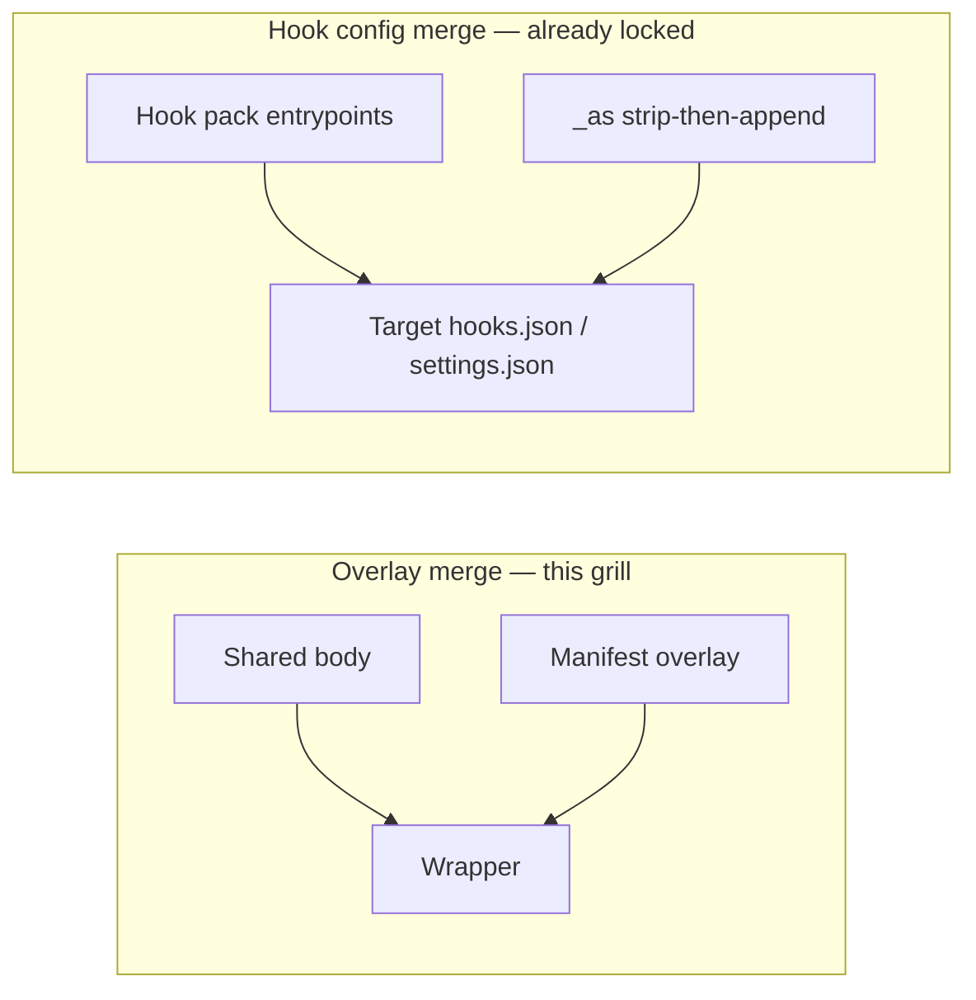

# Grilling brief: Manifest schema and overlay merge

> **Status:** prep only — not a lock. Do not treat this as the Task 5 decision.
> **Task:** agent-sync #5 — *Grill Manifest schema and overlay merge*
> **Type:** HITL grilling (`/grilling` + `/domain-modeling`)
> **Date:** 2026-08-17

**Question to lock:** What is the Manifest schema (filename, required fields, Target list, overlay shape) and the exact merge algorithm when applying overlays onto a shared body?

This brief proposes three options, a recommended option that matches already-locked decisions, two worked examples, and Round 1 frontier questions. After the grill, write the lock back onto the task and (if Overlay is adopted as a term) `CONTEXT.md`.

---

## 1. Locked constraints this schema must honor

From the wayfinder map and completed research (do not relitigate):

| Lock | Implication for Manifest |
|------|--------------------------|
| Per-item Manifest in Library | One Manifest beside each item, not a repo-wide lockfile |
| Shared body + Manifest overlays → light Wrappers | Overlay is a thin patch, not a fork of the body |
| Kinds: skills, commands, agents, hooks | Envelope must cover all four; hooks are Hook packs |
| v1 Targets: Claude Code, Cursor, `.agents`, OpenCode, Pi | Target ids must name these five |
| Unsupported kinds skip; `verify` reports | Manifest exclude ≠ adapter skip; both need distinct reasons |
| Cursor always copy; coerce copy if parent is a symlink | Install mode is adapter, not a Manifest field |
| Hooks: tagged `_as` strip-then-append into Cursor `hooks.json` / Claude `settings.json` | That is **config merge** (Task 3). This grill is **overlay merge** (Manifest ⊗ body → Wrapper) |
| Cursor product skills live under `library/skills/vendor/cursor/` | Vendor path is Library layout; Manifest still per-item |
| Third-party stays `npx skills` | Manifest does not describe npx installs |
| Cursor commands deprecated → prefer `~/.cursor/skills/` | Adapter mapping; grill whether Manifest needs a field |

Parked (other tasks): local-wins (Task 6), migrate UX (Task 7), fan-out naming / whether `.agents` stays a v1 Target (Task 11). Schema should still reserve a Target id for `.agents`.

---

## 2. Two merge problems (do not conflate)



- **Overlay merge:** how a Manifest patch is applied to a skill/command/agent body to produce a Wrapper. Arrays, nulls, frontmatter-only keys live here.
- **Hook config merge:** how a Hook pack’s already-Target-shaped entrypoints are installed into live config. Algorithm is locked: strip `agent-sync:<pack>:` → append → atomic write. Hand edits without `_as` are untouched.

Hook packs do not overlay a markdown body. Their per-Target JSON/YAML entrypoints *are* the payload. Exclude still applies.

---

## 3. Candidate glossary term (do not write `CONTEXT.md` until locked)

**Overlay** (proposed): the Target-keyed patch in a Manifest applied onto the shared body to produce a Wrapper. For markdown kinds, a JSON Merge Patch on YAML frontmatter. For Hook packs, not used — entrypoints live under a `hooks` payload instead.

_Avoid:_ template, variant, fork, patch file (ambiguous with git).

Existing terms (Library, Target, Wrapper, Fan-out, Manifest, Hook pack, Vendor skill) are unchanged.

---

## 4. Options

All three are per-item, cover all four kinds, and keep Wrappers light. They differ on filename, field layout, and overlay algorithm.

### Option A — recommended: unified `manifest.json` + JSON Merge Patch (frontmatter only)

**Filename:** `manifest.json` at the root of every Library item directory.

**Layout (directory-per-item for all kinds):**

```
library/skills/<name>/SKILL.md + manifest.json
library/commands/<name>/BODY.md + manifest.json
library/agents/<name>/BODY.md + manifest.json
library/hooks/<name>/manifest.json + hooks/*.sh
```

Commands and agents become directories so the Manifest always has the same path. Adapter maps `BODY.md` → Target file (`<name>.md`, or Cursor command→skill `SKILL.md`).

**Envelope fields:**

| Field | Required | Notes |
|-------|----------|--------|
| `schema` | yes | Integer; start at `1` |
| `kind` | no* | `skill` \| `command` \| `agent` \| `hooks`. Infer from Library folder; if present, must match |
| `name` | no* | Infer from directory; if present, must match. `verify` fails on mismatch |
| `version` | hooks yes; others no | Semver string. Feeds `_as` tags (`agent-sync:<name>:<version>:<event>:<n>`) |
| `targets.include` | no | Opt-in list of Target ids. Omit = all v1 Targets that support this kind |
| `targets.exclude` | no | Subtracted after include (or after all-supported). Explicit even when the kind is unsupported |
| `overlays.<target>` | no | Markdown kinds only. Merge-patch document for frontmatter |
| `hooks.<target>` | hooks yes | Absorbs the Task 3 `hook-pack.json` `targets` map (Cursor flat entries / Claude event-groups / later `.agents` HOOK.yaml) |

\*Infer-from-path keeps authoring light; explicit fields are optional checksums.

**Target ids:** `claude` | `cursor` | `agents` | `opencode` | `pi`.

**Overlay merge algorithm (markdown kinds):** RFC 7396 JSON Merge Patch on frontmatter only.

1. Parse shared body into YAML frontmatter mapping `F` + markdown body `B`.
2. Let `P = overlays.<target>.frontmatter` (JSON object). If absent, Wrapper = identity (`F` + `B`).
3. `F' = merge_patch(F, P)`:
   - object ⊗ object → recurse
   - overlay value replaces scalars
   - arrays are **replaced wholesale** (not concatenated)
   - `null` **deletes** the key (tombstone)
4. Emit Wrapper = YAML(`F'`) + unchanged `B`.
5. Illegal: `overlays.<target>` when that Target is excluded, or when the kind is unsupported for that Target. `verify` errors, sync skips the item for that Target.
6. Body replace / body prefix: **forbidden in v1** (keeps Wrappers light). Cursor-only prose waits for a later grill if needed.

**Hook payload:** no merge-patch. `hooks.cursor` / `hooks.claude` are the source objects from research. Config install remains strip-then-append. Scripts copy to Target hook dirs with `as-<pack>-` prefix (research).

**Why this matches locks:** one per-item Manifest; same envelope for all four kinds; overlays are frontmatter-only (light Wrappers); `hook-pack.json` draft is adopted by absorption rather than a second filename; exclude is first-class; Cursor command→skill stays an adapter rule (no extra field).

---

### Option B: same schema, `manifest.yaml`

**Filename:** `manifest.yaml` (reject `.yml` to avoid dual extensions).

**Fields:** identical to Option A (YAML encoding of the same envelope).

**Overlay merge:** identical JSON Merge Patch, applied after YAML parse of `overlays.<target>.frontmatter`.

**Trade:** comments in-file (`# Cursor-only; Claude has no such key`). Cost: YAML footguns (duplicate keys, Norway problem), extra Rust YAML dep, diverges from the `hook-pack.json` draft filename. Shared SKILL.md frontmatter is already YAML — two YAML layers are easier to confuse.

Pick B only if authoring comments outweigh parser simplicity.

---

### Option C: kind-split files + overlay sidecars

**Filenames:**

- skills/commands/agents: `targets.yaml` listing include/exclude, plus `overlays/<target>.yaml` merge-patch files
- hooks: keep research `hook-pack.json` as the Manifest

**Fields:** no unified envelope. Hook packs keep `name`, `version`, `targets.<target>.<event>`. Markdown kinds keep Target lists separate from overlay files.

**Overlay merge:** each `overlays/<target>.yaml` *is* the merge-patch document (same RFC 7396 rules as A). Missing file = identity Wrapper.

**Trade:** matches the hook research filename literally; overlay files are tiny and diff-friendly. Cost: three patterns to teach; commands/agents can stay single files (sidecar `foo.targets.yaml`) but skills/hooks are directories; “commands and agents share the same Manifest shape as skills” stays unanswered by splitting further. Violates the spirit of one per-item Manifest type.

---

## 5. Recommendation

**Lock Option A.**

- Per-item, one filename, four kinds.
- Light Wrappers = shared markdown body + optional frontmatter merge-patch.
- Hook packs use the same file; `hooks.*` absorbs `hook-pack.json` (research §6 becomes the `hooks` field).
- Default fan-out is all-supported minus `exclude` (opt-out), so most items are a 5-line Manifest or even `{ "schema": 1 }`.
- Cursor command→skill is an adapter table, not a Manifest key (path matrix §6.2).
- JSON keeps Manifest visually distinct from YAML frontmatter and matches the hook draft’s data model.

Option B is the fallback if the grill prefers comments. Option C only if we explicitly reject a shared shape for hooks vs markdown kinds.

---

## 6. Worked examples (under Option A)

### 6.1 Skill with Cursor-only overlay

Library item `library/skills/personal-voice-model/` — fans out to every Target that supports skills. Cursor gets one extra frontmatter key (`disable-model-invocation`); Claude / `.agents` / OpenCode / Pi get the shared frontmatter unchanged.

**Shared body** `SKILL.md`:

```markdown
---
name: personal-voice-model
description: >-
  Refine or apply Andrew's personal speech/writing voice model from Slack
  history. Use when the user invokes /personal-voice-model, asks to refine the
  voice model, runs /loop on this skill, or explicitly asks to write as them
  using the personal voice model.
---

# Personal Voice Model

Living voice guidance for writing *as Andrew*.
```

**Manifest** `manifest.json`:

```json
{
  "schema": 1,
  "kind": "skill",
  "name": "personal-voice-model",
  "overlays": {
    "cursor": {
      "frontmatter": {
        "disable-model-invocation": true
      }
    }
  }
}
```

No `targets` key → all skill-capable Targets (all five v1 Targets).

**Cursor Wrapper frontmatter** (after merge-patch):

```yaml
name: personal-voice-model
description: >-
  Refine or apply Andrew's personal speech/writing voice model from Slack
  history. Use when the user invokes /personal-voice-model, asks to refine the
  voice model, runs /loop on this skill, or explicitly asks to write as them
  using the personal voice model.
disable-model-invocation: true
```

**Claude (and others) Wrapper frontmatter:** identical to the shared file — overlay absent ⇒ identity. Markdown body is byte-identical on every Target.

**Tombstone (illustrative, not this skill):** if shared had `allowed-tools: Bash` (Claude-only) and Cursor must not emit it:

```json
"overlays": {
  "cursor": { "frontmatter": { "allowed-tools": null } }
}
```

Merge-patch removes the key from the Cursor Wrapper only.

**Array replace (illustrative, agents):** shared `tools: [Read, Grep]` plus Cursor overlay `tools: [Read, Grep, Shell]` yields `[Read, Grep, Shell]`, not a concat.

---

### 6.2 Hook pack excluding OpenCode

Library item `library/hooks/skill-gates/` — Claude + Cursor (+ `.agents` if still a hook Target). OpenCode is **excluded in the Manifest** even though hooks are already unsupported there. `verify` can report `excluded` vs `unsupported-kind` separately. Pi is not listed in `exclude`; adapter skip for Pi hooks remains `unsupported-kind`.

**Tree:**

```
library/hooks/skill-gates/
  manifest.json
  hooks/enforce-gate.sh
```

**Manifest** `manifest.json` (absorbs research `hook-pack.json`):

```json
{
  "schema": 1,
  "kind": "hooks",
  "name": "skill-gates",
  "version": "1.0.0",
  "targets": {
    "exclude": ["opencode"]
  },
  "hooks": {
    "cursor": {
      "preToolUse": [
        {
          "command": "as-skill-gates-enforce-gate.sh",
          "matcher": "StrReplace|Write|EditNotebook",
          "failClosed": true,
          "timeout": 10
        }
      ]
    },
    "claude": {
      "PreToolUse": [
        {
          "matcher": "Write|Edit",
          "hooks": [
            {
              "type": "command",
              "command": "bash ~/.claude/hooks/as-skill-gates-enforce-gate.sh",
              "timeout": 5,
              "statusMessage": "Checking skill gate..."
            }
          ]
        }
      ]
    }
  }
}
```

Fan-out copies `hooks/enforce-gate.sh` → `~/.cursor/hooks/as-skill-gates-enforce-gate.sh` and `~/.claude/hooks/as-skill-gates-enforce-gate.sh` (namespace prefix from research). Config merge then strip-then-appends tagged entries. `_as` example: `agent-sync:skill-gates:1.0.0:preToolUse:0`.

**OpenCode:** Manifest exclude → do not write plugins, do not invent `hooks.yaml`. `verify`: `skill-gates @ opencode: skipped (excluded)`.

**If `exclude` were omitted:** OpenCode would still skip via kind matrix (`UNSUPPORTED`), reported as `skipped (unsupported-kind)`. Explicit exclude documents intent if OpenCode later grows plugin hooks.

No `overlays` key — Hook packs do not merge-patch markdown.

---

## 7. Edge cases the algorithm must state (grill or accept as recommended)

| Case | Recommended rule |
|------|------------------|
| Missing Manifest | `verify` error; `sync` skips the item. `migrate` writes `{ "schema": 1 }` |
| Empty `{ "schema": 1 }` | Valid. All-supported Targets, identity Wrappers |
| `include` + `exclude` | Resolve include (or all-supported) then subtract exclude |
| `include: []` | Fan-out nowhere; `verify` warns |
| Overlay for excluded Target | `verify` error |
| Overlay for unsupported kind | `verify` error |
| Extra JSON keys | Reject unknown envelope keys (`schema` bump to add fields). Frontmatter overlay keys are opaque (Target-defined) |
| Duplicate Target ids | `verify` error |
| `name` / `kind` mismatch with path | `verify` error |
| Hook `version` missing | `verify` error (needed for `_as`) |
| Markdown `version` missing | Allowed; not written into frontmatter unless overlaid |
| Array overlay | Replace entire array; authors list the full desired value |
| Frontmatter key types differ (string vs seq) | Overlay wins (replace) |
| `.agents` hook payload | Slot `hooks.agents` reserved; exact HOOK.yaml shape can follow Task 11 if `.agents` remains a Target |

Cursor command→skill: **not a Manifest field**. Adapter: `kind=command` + Target `cursor` → `~/.cursor/skills/<name>/SKILL.md` (always copy). Other Targets use the commands path from the matrix.

---

## 8. Design tree

```text
Manifest schema
├── Filename + encoding .................... Round 1
├── Required vs optional Manifest ......... Round 1
├── Target ids ............................ Round 1
├── Default include policy ................ Round 1
├── Unified envelope vs kind-split ........ Round 1
├── Overlay algorithm ..................... Round 1
├── Overlay surface (frontmatter vs body) . Round 1
└── (after Round 1)
    ├── Directory-per-item for commands/agents
    ├── Body filename (SKILL.md / BODY.md)
    ├── Absorb hook-pack.json vs keep filename
    ├── include+exclude interaction details
    ├── verify skip taxonomy (excluded vs unsupported)
    ├── .agents hook payload
    └── Cursor command→skill as adapter vs field
```

Round 1 is the frontier: none of those seven depend on another still-open answer.

---

## 9. Round 1 grill questions

❓ **Q1** - **Filename and encoding**: `manifest.json` (A), `manifest.yaml` (B), or kind-split `hook-pack.json` + overlay files (C)?

➡️ **A — `manifest.json`.** One per-item file; JSON distinct from YAML frontmatter; absorbs the hook draft without a second name.

❓ **Q2** - **Is Manifest required?**: Every item must have one, vs optional-with-defaults when absent?

➡️ **Required.** `migrate` writes `{ "schema": 1 }` for identity items. Absence is a `verify` error so Library inventory is complete.

❓ **Q3** - **Target ids**: `claude` / `cursor` / `agents` / `opencode` / `pi`?

➡️ **Yes.** `agents` means the `.agents` Target. Task 11 may drop that Target later; do not bikeshed `dot-agents` unless the id is ambiguous.

❓ **Q4** - **Default fan-out**: opt-out (`exclude` from all-supported) or opt-in (`include` required)?

➡️ **Opt-out.** Matches “most skills go everywhere”; unsupported kinds still skip at the adapter. Use `include` only to narrow.

❓ **Q5** - **Shared envelope for all four kinds?**

➡️ **Yes.** `kind` + optional `overlays` (markdown) + optional `hooks` (Hook packs). Reject Option C’s split unless hooks are declared a different Manifest type.

❓ **Q6** - **Overlay algorithm for frontmatter**: RFC 7396 merge-patch (replace arrays, `null` deletes), deep-merge with array concat, or JSON Patch (RFC 6902)?

➡️ **Merge-patch.** Light, tombstones for Claude-only keys like `allowed-tools`, no concat surprises on `tools` arrays. JSON Patch is not light.

❓ **Q7** - **May overlays edit the markdown body in v1?**

➡️ **No.** Frontmatter only. Body prefix/replace would turn Wrappers into forks. Revisit only with a real Target-specific prose need.

---

## 10. Out of this grill

- Local vs public Library conflict (Task 6)
- `migrate` dry-run / rollback (Task 7)
- Fan-out naming prefix and `.agents` as a v1 Target (Task 11)
- Hook config `_as` strip-then-append (locked in Task 3)
- Install symlink vs copy (locked; Cursor always copy)
- Release/signing, rcup wiring

---

## 11. Sources

- `.taskmaster/docs/wayfinder-agent-sync-map.md` — locks + “not yet specified”
- `CONTEXT.md` — Library / Target / Wrapper / Fan-out / Manifest / Hook pack
- `.taskmaster/docs/research-target-install-path-matrix.md` — Target×kind paths, Cursor command→skill, skip rules
- `.taskmaster/docs/research-hook-config-merge.md` — `_as` tags, `hook-pack.json` draft, strip-then-append
- `.taskmaster/docs/research-npx-skills-coexistence.md` — do not encode npx into Manifest (Task 11 for `.agents`)
- Live examples: `.cursor/skills/personal-voice-model/SKILL.md` (`disable-model-invocation`); `.cursor/skills/_shared/hooks/enforce-gate.sh`; `.claude/skills/read-memories/SKILL.md` (`allowed-tools`)
