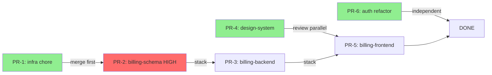

# Pattern 5: Sequencing and Stack Plan

Determine the merge order and identify which PRs can be reviewed in parallel. Produce the final deliverable: a merge sequence, a stacking diagram (when needed), and a typed hand-off block for `split-to-prs` (which dispatches stacked groups to `gh-stack`).

## Goal

Given the named PRs from Pattern 4 and their dependency edges from Pattern 2, produce:
1. A **merge sequence** — the order in which PRs must merge to keep main green at every step.
2. A **parallelism map** — which PRs can be opened for review simultaneously (even if they cannot merge simultaneously).
3. A **stacking plan** — for HARD-dependent chains, the base branch each PR should target (main vs a prior PR branch).
4. A **typed hand-off block** for `split-to-prs` — execution groups plus per-PR file lists so the executor does not re-analyze the changeset.

## Sequencing rules

**Rule 1: Topological order for HARD dependencies.**
Sort the PR graph topologically. Nodes with no incoming hard-dependency edges can go first. Nodes with incoming edges come after their dependencies.

**Rule 2: Independent PRs can merge in any order but should merge early.**
PRs with no dependencies (no edges in the dependency graph) are quick wins. Schedule them first in the merge sequence — they unblock reviewers and keep the branch list clean.

**Rule 3: Low-risk PRs should open for review immediately.**
Even if a low-risk PR cannot merge before its dependency, open it for review now. Reviewers can approve it while waiting for the dependency to land.

**Rule 4: HIGH-risk PRs should have dedicated review time.**
Do not open a HIGH-risk PR simultaneously with other PRs targeting the same reviewer team if it can be avoided. Give it focused attention.

**Rule 5: Stack only when strictly necessary.**
Stacked PRs (PR-B targets PR-A's branch instead of main) create maintenance overhead when the base changes. Use stacking only for HARD-dependent chains where the consuming PR would not compile without the foundation. For SOFT dependencies, just note the recommended review order without stacking.

**Rule 6: Stack groups must be linear (gh-stack constraint).**
`gh stack` supports only linear chains (each branch has one parent and at most one child). Prefer a single bottom→top order (e.g. schema → backend → frontend). If the dependency graph fans out (two consumers of one foundation), either (a) serialize siblings into one linear stack, or (b) emit separate stack groups that do not share branches. Do not emit a branching stack in the hand-off. If the only honest plan is non-linear, still describe the fan-out in the merge sequence, mark the stack group as `linear: false`, and leave resolution to `split-to-prs` (warn + ask before opening).

## Step-by-Step Process

### Step 1: Topological sort of the PR graph

Use the dependency table from Pattern 4. Perform a topological sort:

```
Given edges: PR-2 -> PR-3, PR-2 -> PR-5, PR-4 -> PR-5
And independent nodes: PR-1, PR-6, PR-4

Sort result:
  Wave 1 (no dependencies): PR-1, PR-4, PR-6
  Wave 2 (depends on Wave 1 only): PR-2
  Wave 3 (depends on PR-2): PR-3, PR-5
```

Waves represent "can merge in parallel within the wave, but this wave must complete before the next begins."

### Step 2: Determine stacking vs sequential

For each HARD-dependent edge (A -> B), decide:

| Condition | Approach |
| --------- | -------- |
| B will not compile without A merged | Stack: B targets A's branch |
| B will compile but tests fail without A | Stack: B targets A's branch |
| B compiles and tests pass without A but behavior is incorrect | Sequential: merge A to main first, then open B against main |
| B works independently but benefits from A being visible | No stack: just document review order |

Only create a stacked PR when the consuming PR is **unrunnable** without the base. In all other cases, sequential merge without stacking is cleaner.

When multiple PRs HARD-depend on the same foundation, **linearize for execution** (pick a review-friendly order among siblings) rather than targeting the same base from two branches. Example: edges `PR-2 -> PR-3` and `PR-2 -> PR-5` become stack order `[PR-2, PR-3, PR-5]` (default foundation → service → UI). Soft deps (e.g. PR-4 → PR-5) stay out of the stack group.

### Step 3: Produce the merge sequence

```markdown
## Merge Sequence

### Wave 1 — Open immediately, merge in any order
These have no dependencies. Open all for review now.

1. **PR-1:** chore: infra — env vars
   Base: main
   Review: trivial, fast-track

2. **PR-4:** feat: design-system — destructive Button variant
   Base: main
   Review: design-system owners

3. **PR-6:** refactor: auth — remove deprecated login path
   Base: main
   Review: auth area owners; verify no behavior change

### Wave 2 — Open after PR-1 merges
PR-2 has a soft dependency on PR-1 (env var). Open for review now, but merge only after PR-1.

4. **PR-2:** feat: billing-schema — invoice_status
   Base: main (merge after PR-1)
   Review: psgen/schema familiarity required; HIGH risk — dedicated reviewer
   Note: Irreversible migration — PR description must include rollback plan

### Wave 3 — Open stacked on PR-2 (linearized for gh-stack)
PR-3 and PR-5 HARD-depend on PR-2. Fan-out is not supported by `gh stack`, so serialize: backend then frontend. Both remain separately reviewable PRs in one linear stack.

5. **PR-3:** feat: billing-backend — invoice status logic
   Base: feat/billing-schema-invoice-status (stack layer 2)
   Rebase via `gh stack sync` after PR-2 merges
   Review: route-impl layer owners

6. **PR-5:** feat: billing-frontend — invoice status UI
   Base: feat/billing-backend-invoice-status (stack layer 3)
   Soft-depends on PR-4 (new Button) — merge PR-4 first or note in PR body; do not fan-out stack on PR-4
   Rebase via `gh stack sync` after lower layers merge
   Review: frontend owners

### Merge timeline (earliest-path)
Day 1: Open PR-1, PR-4, PR-6 -> merge all
Day 2: Open PR-2 as bottom of billing stack -> merge when ready
Day 3: `gh stack sync` / merge PR-3 then PR-5 up the stack
```

### Step 4: Produce the Mermaid sequencing diagram



### Step 5: Write the split-to-prs hand-off block

This block is the direct input to the `split-to-prs` skill for execution. It must be complete enough that `split-to-prs` can execute without re-analyzing the changeset. Use **execution groups** so the executor can route independents vs stacks without re-deriving the graph.

```markdown
## Hand-off to split-to-prs

### Execution groups

**group: independent**
executor: split-to-prs
prs: [PR-1, PR-4, PR-6]

**group: stack**
executor: gh-stack
linear: true
order: [PR-2, PR-3, PR-5]
# bottom → top; only HARD uncompilable deps

### PR split plan (ready for execution)

**PR-1: chore: infra — add INVOICE_STATUS_ENABLED env var**
Branch: chore/add-invoice-status-env-var
Base: main
Files:
  - services/web-api/.env.example
  - apps/web-app/.env.example

**PR-4: feat: design-system — add destructive Button variant**
Branch: feat/design-system-destructive-button
Base: main
Files:
  - apps/packages/design-system/src/lib/atoms/button/Button.component.svelte
  - apps/packages/design-system/src/lib/atoms/button/Button.types.ts

**PR-6: refactor: auth — remove deprecated login path**
Branch: refactor/auth-remove-deprecated-login
Base: main
Files:
  - apps/web-app/src/lib/domains/auth/components/login/OldLoginFlow.svelte  (delete)
  - apps/web-app/src/routes/auth/+page.svelte  (modified)

**PR-2: feat: billing-schema — add invoice_status (HIGH RISK)**
Branch: feat/billing-schema-invoice-status
Base: main (merge after PR-1 — soft dep, not stacked)
Files:
  - platform-schemas/schemas/billing.graphql
  - services/web-db/migrations/sql/[timestamp]_add_invoice_status.up.sql
  - services/web-db/migrations/sql/[timestamp]_add_invoice_status.down.sql
  - platform-schemas/dist/**  (regenerated — include all changed generated files)
PR description must include: rollback plan, psgen command used

**PR-3: feat: billing-backend — invoice status logic (STACKED on PR-2)**
Branch: feat/billing-backend-invoice-status
Base: feat/billing-schema-invoice-status
Files:
  - services/web-api/internal/route-impl/billing_invoice_status.go
  - services/web-api/internal/route-impl/billing_invoice_status_test.go

**PR-5: feat: billing-frontend — invoice status UI (STACKED on PR-3)**
Branch: feat/billing-frontend-invoice-status
Base: feat/billing-backend-invoice-status
Files:
  - apps/web-app/src/lib/domains/billing/components/invoice-status/
  - apps/web-app/src/lib/domains/billing/components/invoice-status.test.ts
```

If linearization is impossible or undesirable, set `linear: false` on the stack group and list the fan-out edges explicitly. Do not invent a false linear order — `split-to-prs` will warn and ask before opening.

## Review parallelism summary

Communicate clearly which PRs reviewers can review simultaneously:

```markdown
## Parallel review opportunities

- PR-1, PR-4, PR-6 can all be reviewed and merged in parallel — no coordination needed.
- PR-2 should wait for PR-1 to merge before opening (soft dep), but can be reviewed in parallel with PR-4 and PR-6.
- PR-3 and PR-5 are separate PRs in one linear stack — reviewable in parallel once opened; merge bottom→top.

**Earliest full merge:** ~3 review cycles if reviewers are available same-day.
**Critical path:** PR-1 -> PR-2 -> PR-3 -> PR-5 (linear stack).
```

## Common mistakes in sequencing

| Mistake | Consequence | Correction |
| ------- | ----------- | ---------- |
| Opening all PRs at once when dependencies exist | Reviewers block on unresolvable CI / wrong bases | Open Wave 1 first; open dependent PRs as a linear stack only when ready |
| Emitting fan-out stacks (two children, one parent) | `gh stack` cannot represent the plan | Linearize siblings or mark `linear: false` and ask |
| Rebasing stacked PRs manually for every change to the base | Significant developer overhead | Use `gh stack sync` / rebase after base merges — not continuously |
| Marking soft dependencies as stacking targets | Unnecessary branch complexity | Use sequential merge, not stacking, for soft dependencies |
| Not communicating the parallelism map to reviewers | Reviewers block on a single PR sequentially | Share the merge sequence and parallelism map in Slack or PR descriptions |
| Hand-off without execution groups | `split-to-prs` cannot route to `gh-stack` | Always include `### Execution groups` with `executor:` |

## Checklist

- [ ] Topological sort completed (waves identified)
- [ ] Each PR assigned to a wave
- [ ] Stacking decisions made (only for HARD uncompilable dependencies)
- [ ] Stack groups are linear (`linear: true`) or explicitly `linear: false`
- [ ] Stacked PRs have rebase / sync instructions noted
- [ ] Merge sequence table produced
- [ ] Mermaid diagram produced for non-trivial sequences
- [ ] Parallel review opportunities documented
- [ ] Critical path identified
- [ ] split-to-prs hand-off block written (execution groups + complete PR list with branches, bases, files)
