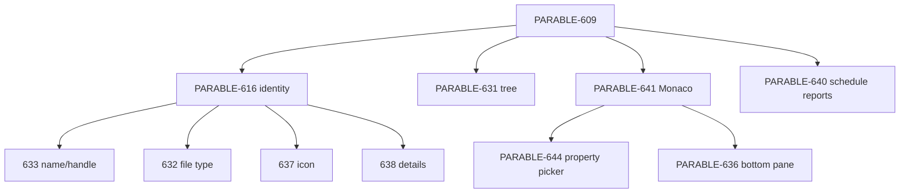

# Child dependency / ship order

Recommended ship order:

1. PARABLE-641 shared Monaco / Piece source editor
2. PARABLE-644 Property Picker (blocked by 641)
3. PARABLE-616 + 633/632/637/638 identity children
4. PARABLE-631 tree navigation
5. PARABLE-636 editor output bottom pane
6. PARABLE-640 schedule reports
